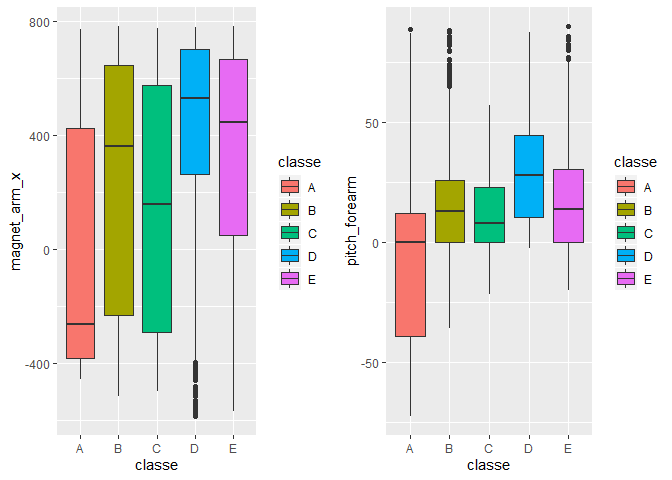
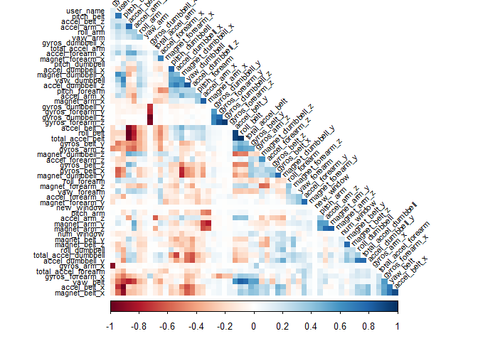
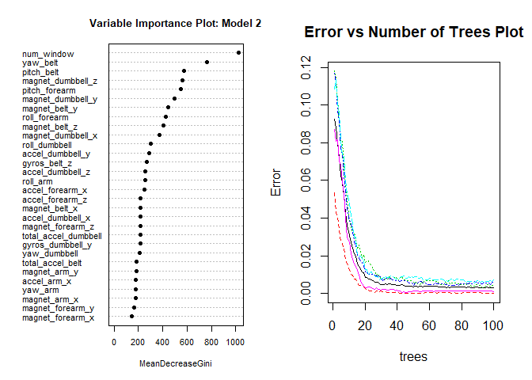

Coursera\_Machine\_Learning-Course\_Project
================
Jordan Woloschuk
10/28/2019

## 1\) Executive Summary

### 1.1) Overview

The purpose of this analysis is to develop a model that will be able to
predict what exercise was preformed using a dataset with 159 features.

This analysis will detail the steps taken in the following sections:

1.  Executive Summary
2.  Data Processing
3.  Exploratory Data Analysis
4.  Model Development
5.  Conclusion

## 2\) Data Processing

### 2.0) Loading Libraries

Load necessary libraries for data analysis and developing results.

``` r
library(lattice)
library(ggplot2)
library(plyr)
library(randomForest)
library(caret)
library(Rmisc)
library(corrplot)
library(randomForest)
```

### 2.1) Loading Data Files

Load necessary ftiness data files.

``` r
training.raw <- read.csv("pml-training.csv")
testing.raw <- read.csv("pml-testing.csv")
```

### 2.2) Exploratory Data Analysis

``` r
head(training.raw,2) # Sample of the first 2 rows of data
dim(training.raw) # Dimensions of the training data
```

From this analysis we can see that a large number of cell are empty /
contain NA.

### 2.3) Modifying Data

First remove all columns which have more than 20% of the rows empty or
NA.

``` r
max_NA = 20 # arbitrary 
NA_count <- nrow(training.raw) / 100 * max_NA
remove_columns <- which(colSums(is.na(training.raw) | training.raw=="") > NA_count)
training.cleaned <- training.raw[,-remove_columns]
testing.cleaned <- testing.raw[,-remove_columns]
```

Second, we will remove all time series related data since we will not be
using this data in the analysis.

``` r
remove_columns <- grep("timestamp", names(training.cleaned))
training.cleaned <- training.cleaned[,-c(1, remove_columns )]
testing.cleaned <- testing.cleaned[,-c(1, remove_columns )]
```

Fianlly, we will convert all factors to integers.

``` r
classeLevels <- levels(training.cleaned$classe)
training.cleaned <- data.frame(data.matrix(training.cleaned))
training.cleaned$classe <- factor(training.cleaned$classe, labels=classeLevels)
testing.cleaned <- data.frame(data.matrix(testing.cleaned))
```

## 3\) Exploratory Data Analysis

We will split the training set into a “test and train” set to develop
the model, since the origional test set is for final validation of the

``` r
set.seed(12345)

classe_index <- which(names(training.cleaned) == "classe")
partition <- createDataPartition(y=training.cleaned$classe, p=0.75, list=FALSE)
training.subTrain <- training.cleaned[partition, ]
training.subTest <- training.cleaned[-partition, ]
```

We will now identify some of the fields with high correlations with the
classe?

``` r
correlations <- cor(training.subTrain[, -classe_index], as.numeric(training.subTrain$classe))
best_Correlations <- subset(as.data.frame(as.table(correlations)), abs(Freq)>0.3)
print(best_Correlations)
```

    ##             Var1 Var2      Freq
    ## 44 pitch_forearm    A 0.3475429

From this, we can see that the best correlations with classe result in
an frequency of 0.35. We will now check visually if there is a possible
simple linear predictors based on these two features.

``` r
plot_1 <- ggplot(training.subTrain, aes(classe, magnet_arm_x)) + 
        geom_boxplot(aes(fill=classe))
plot_2 <- ggplot(training.subTrain, aes(classe,pitch_forearm)) + 
        geom_boxplot(aes(fill=classe))

multiplot(plot_1,plot_2,cols=2)
```

<!-- -->

From these plots it can be seen that there is no seperation of classes
possible using only these two ‘highly’ correlated features. We will need
to train a model to get closer to a way of predicting the classes.

## 4\) Model Development

### 4.1) Model Selection

We will now try to identify which variables have high correlations
amongst each other in our set, so that we can possibly exclude these
redundent varaibles from the pca or training.

We will then check to see if the removal of these variables results in a
model that is more accurate.

``` r
correlation_matrix <- cor(training.subTrain[, -classe_index])
highly_correlated <- findCorrelation(correlation_matrix, cutoff=0.9, exact=TRUE)
exclude_columns <- c(highly_correlated, classe_index)
corrplot(correlation_matrix, method="color", type="lower", order="hclust", tl.cex=0.70, tl.col="black", tl.srt = 45, diag = FALSE)
```

<!-- -->

From this plot we can see that some features that are very correlated
with each other. The model that we develop will excluded these redundent
features. Also we’ll attempt to reduce the total number of features by
running PCA on all features and the excluded subset of the features.

``` r
#All data
pca_PreProcess.all <- preProcess(training.subTrain[, -classe_index], method = "pca", thresh = 0.99)
training.subTrain.pca.all <- predict(pca_PreProcess.all, training.subTrain[, -classe_index])
training.subTest.pca.all <- predict(pca_PreProcess.all, training.subTest[, -classe_index])
testing.pca.all <- predict(pca_PreProcess.all, testing.cleaned[, -classe_index])
#Subset data
pca_PreProcess.subset <- preProcess(training.subTrain[, -exclude_columns], method = "pca", thresh = 0.99)
training.subSetTrain.pca.subset <- predict(pca_PreProcess.subset, training.subTrain[, -exclude_columns])
training.subSetTest.pca.subset <- predict(pca_PreProcess.subset, training.subTest[, -exclude_columns])
testing.pca.subset <- predict(pca_PreProcess.subset, testing.cleaned[, -classe_index])
```

Next, we will do some Random Forest training. In this process we will
use 100 trees, from trial and error, it appears that the error rate
doesn’t significantly decline with more than 50 trees.

We’ll use 200 trees, because I’ve already seen that the error rate
doesn’t decline a lot after say 50 trees, but we still want to be
thorough. Also we will time each of the 4 random forest models to see if
when all else is equal one pops out as the faster one.

``` r
ntree <- 100 #Our assumed number of trials
# Forest 1
start <- proc.time()
rf_Model.cleaned_1 <- randomForest(
  x=training.subTrain[, -classe_index], 
  y=training.subTrain$classe,
  xtest=training.subTest[, -classe_index], 
  ytest=training.subTest$classe, 
  ntree=ntree,
  keep.forest=TRUE,
  proximity=TRUE) #do.trace=TRUE
proc.time() - start
```

    ##    user  system elapsed 
    ##   50.35    0.93   51.39

``` r
ntree <- 100 #Our assumed number of trials
# Forest 2
start <- proc.time()
rf_Model.exclude_2 <- randomForest(
  x=training.subTrain[, -exclude_columns], 
  y=training.subTrain$classe,
  xtest=training.subTest[, -exclude_columns], 
  ytest=training.subTest$classe, 
  ntree=ntree,
  keep.forest=TRUE,
  proximity=TRUE) #do.trace=TRUE
proc.time() - start
```

    ##    user  system elapsed 
    ##   45.00    1.26   46.35

``` r
ntree <- 100 #Our assumed number of trials
# Forest 3
start <- proc.time()
rf_Model.pca.all_3 <- randomForest(
  x=training.subTrain.pca.all, 
  y=training.subTrain$classe,
  xtest=training.subTest.pca.all, 
  ytest=training.subTest$classe, 
  ntree=ntree,
  keep.forest=TRUE,
  proximity=TRUE) #do.trace=TRUE
proc.time() - start
```

    ##    user  system elapsed 
    ##   47.79    1.63   49.47

``` r
ntree <- 100 #Our assumed number of trials
# Forest 4
start <- proc.time()
rf_Model.pca.subset_4 <- randomForest(
  x=training.subSetTrain.pca.subset, 
  y=training.subTrain$classe,
  xtest=training.subSetTest.pca.subset, 
  ytest=training.subTest$classe, 
  ntree=ntree,
  keep.forest=TRUE,
  proximity=TRUE) #do.trace=TRUE
proc.time() - start
```

    ##    user  system elapsed 
    ##   45.18    1.53   46.89

### 4.2) Model Evaluation

We will now check the accuracies of the the four developed models.

``` r
rf_Model.cleaned_1
```

    ## 
    ## Call:
    ##  randomForest(x = training.subTrain[, -classe_index], y = training.subTrain$classe,      xtest = training.subTest[, -classe_index], ytest = training.subTest$classe,      ntree = ntree, proximity = TRUE, keep.forest = TRUE) 
    ##                Type of random forest: classification
    ##                      Number of trees: 100
    ## No. of variables tried at each split: 7
    ## 
    ##         OOB estimate of  error rate: 0.3%
    ## Confusion matrix:
    ##      A    B    C    D    E  class.error
    ## A 4184    0    0    0    1 0.0002389486
    ## B    5 2839    4    0    0 0.0031601124
    ## C    0   12 2555    0    0 0.0046747176
    ## D    0    0   17 2392    3 0.0082918740
    ## E    0    0    0    2 2704 0.0007390983
    ##                 Test set error rate: 0.29%
    ## Confusion matrix:
    ##      A   B   C   D   E class.error
    ## A 1395   0   0   0   0 0.000000000
    ## B    0 949   0   0   0 0.000000000
    ## C    0   2 853   0   0 0.002339181
    ## D    0   0   8 792   4 0.014925373
    ## E    0   0   0   0 901 0.000000000

``` r
rf_Model.cleaned.training.acc <- round(1-sum(rf_Model.cleaned_1$confusion[, 'class.error']),3)
paste("Training Accuracy: ",rf_Model.cleaned.training.acc)
```

    ## [1] "Training Accuracy:  0.983"

``` r
rf_Model.cleaned.testing.acc <- round(1-sum(rf_Model.cleaned_1$test$confusion[, 'class.error']),3)
paste("Testing Accuracy: ",rf_Model.cleaned.testing.acc)
```

    ## [1] "Testing Accuracy:  0.983"

``` r
rf_Model.exclude_2
```

    ## 
    ## Call:
    ##  randomForest(x = training.subTrain[, -exclude_columns], y = training.subTrain$classe,      xtest = training.subTest[, -exclude_columns], ytest = training.subTest$classe,      ntree = ntree, proximity = TRUE, keep.forest = TRUE) 
    ##                Type of random forest: classification
    ##                      Number of trees: 100
    ## No. of variables tried at each split: 6
    ## 
    ##         OOB estimate of  error rate: 0.33%
    ## Confusion matrix:
    ##      A    B    C    D    E  class.error
    ## A 4184    0    0    1    0 0.0002389486
    ## B    5 2837    6    0    0 0.0038623596
    ## C    0   14 2552    1    0 0.0058433970
    ## D    0    0   18 2394    0 0.0074626866
    ## E    0    0    0    3 2703 0.0011086475
    ##                 Test set error rate: 0.35%
    ## Confusion matrix:
    ##      A   B   C   D   E class.error
    ## A 1395   0   0   0   0 0.000000000
    ## B    1 948   0   0   0 0.001053741
    ## C    0   2 853   0   0 0.002339181
    ## D    0   0   9 791   4 0.016169154
    ## E    0   0   0   1 900 0.001109878

``` r
rf_Model.exclude.training.acc <- round(1-sum(rf_Model.exclude_2$confusion[, 'class.error']),3)
paste("Training Accuracy: ",rf_Model.exclude.training.acc)
```

    ## [1] "Training Accuracy:  0.981"

``` r
rf_Model.exclude.testing.acc <- round(1-sum(rf_Model.exclude_2$test$confusion[, 'class.error']),3)
paste("Testing Accuracy: ",rf_Model.exclude.testing.acc)
```

    ## [1] "Testing Accuracy:  0.979"

``` r
rf_Model.pca.all_3
```

    ## 
    ## Call:
    ##  randomForest(x = training.subTrain.pca.all, y = training.subTrain$classe,      xtest = training.subTest.pca.all, ytest = training.subTest$classe,      ntree = ntree, proximity = TRUE, keep.forest = TRUE) 
    ##                Type of random forest: classification
    ##                      Number of trees: 100
    ## No. of variables tried at each split: 6
    ## 
    ##         OOB estimate of  error rate: 2.3%
    ## Confusion matrix:
    ##      A    B    C    D    E class.error
    ## A 4152   19    4    7    3 0.007885305
    ## B   56 2763   23    3    3 0.029845506
    ## C    2   30 2499   30    6 0.026490066
    ## D    3    2   94 2305    8 0.044361526
    ## E    4    8   21   13 2660 0.016999261
    ##                 Test set error rate: 1.79%
    ## Confusion matrix:
    ##      A   B   C   D   E class.error
    ## A 1388   4   2   1   0 0.005017921
    ## B   12 927   8   1   1 0.023182297
    ## C    2  10 841   2   0 0.016374269
    ## D    1   1  23 772   7 0.039800995
    ## E    1   5   7   0 888 0.014428413

``` r
rf_Model.pca.all.training.acc <- round(1-sum(rf_Model.pca.all_3$confusion[, 'class.error']),3)
paste("Training Accuracy: ",rf_Model.pca.all.training.acc)
```

    ## [1] "Training Accuracy:  0.874"

``` r
rf_Model.pca.all.testing.acc <- round(1-sum(rf_Model.pca.all_3$test$confusion[, 'class.error']),3)
paste("Testing Accuracy: ",rf_Model.pca.all.testing.acc)
```

    ## [1] "Testing Accuracy:  0.901"

``` r
rf_Model.pca.subset_4
```

    ## 
    ## Call:
    ##  randomForest(x = training.subSetTrain.pca.subset, y = training.subTrain$classe,      xtest = training.subSetTest.pca.subset, ytest = training.subTest$classe,      ntree = ntree, proximity = TRUE, keep.forest = TRUE) 
    ##                Type of random forest: classification
    ##                      Number of trees: 100
    ## No. of variables tried at each split: 6
    ## 
    ##         OOB estimate of  error rate: 2.6%
    ## Confusion matrix:
    ##      A    B    C    D    E class.error
    ## A 4160   10    6    7    2 0.005973716
    ## B   69 2736   35    3    5 0.039325843
    ## C    6   38 2489   26    8 0.030385664
    ## D    6    5  100 2291   10 0.050165837
    ## E    1   13   18   14 2660 0.016999261
    ##                 Test set error rate: 2.1%
    ## Confusion matrix:
    ##      A   B   C   D   E class.error
    ## A 1387   3   2   3   0 0.005734767
    ## B   14 920  11   1   3 0.030558483
    ## C    1  13 840   1   0 0.017543860
    ## D    2   1  31 765   5 0.048507463
    ## E    0   2   8   2 889 0.013318535

``` r
rf_Model.pca.subset.training.acc <- round(1-sum(rf_Model.pca.subset_4$confusion[, 'class.error']),3)
paste("Training Accuracy: ",rf_Model.pca.subset.training.acc)
```

    ## [1] "Training Accuracy:  0.857"

``` r
rf_Model.pca.subset.testing.acc <- round(1-sum(rf_Model.pca.subset_4$test$confusion[, 'class.error']),3)
paste("Testing Accuracy: ",rf_Model.pca.subset.testing.acc)
```

    ## [1] "Testing Accuracy:  0.884"

## 5\) Conclusion

This concludes that PCA doesn’t have a positive impact on the accuracy
and processing time. The `rf_Model.exclude_2` performs the best compared
to the other models (Although it is about the same as the
`rf_Model.cleaned_1` model, just faster.

Thereforem `rf_Model.exclude_2` is the best model for predicting the
test set. This model resulted in an accuracy of 98.4% and an estimated
OOB error rate of 0.29%.

We will examine this model in a number of plots.

``` r
par(mfrow=c(1,2)) 
varImpPlot(rf_Model.exclude_2, cex=0.7, pch=16, main='Variable Importance Plot: Model 2')
plot(rf_Model.exclude_2, , cex=0.7, main='Error vs Number of Trees Plot')
```

<!-- -->

``` r
par(mfrow=c(1,1)) 
```

### 5.1) Results

We will now examine the predictions for all four models on the final
test set.

``` r
predictions <- t(cbind(
    Exclude_2 =as.data.frame(predict(rf_Model.exclude_2, testing.cleaned[, -exclude_columns]), optional=TRUE),
    cleaned_1 =as.data.frame(predict(rf_Model.cleaned_1, testing.cleaned), optional=TRUE),
    pcaAll_3 =as.data.frame(predict(rf_Model.pca.all_3, testing.pca.all), optional=TRUE),
    pcaExclude_4 =as.data.frame(predict(rf_Model.pca.subset_4, testing.pca.subset), optional=TRUE)
))
predictions
```

    ##              1   2   3   4   5   6   7   8   9   10  11  12  13  14  15 
    ## Exclude_2    "B" "A" "B" "A" "A" "E" "D" "B" "A" "A" "B" "C" "B" "A" "E"
    ## cleaned_1    "B" "A" "B" "A" "A" "E" "D" "B" "A" "A" "B" "C" "B" "A" "E"
    ## pcaAll_3     "B" "A" "B" "A" "A" "E" "D" "B" "A" "A" "B" "C" "B" "A" "E"
    ## pcaExclude_4 "B" "A" "B" "A" "A" "E" "D" "B" "A" "A" "B" "C" "B" "A" "E"
    ##              16  17  18  19  20 
    ## Exclude_2    "E" "A" "B" "B" "B"
    ## cleaned_1    "E" "A" "B" "B" "B"
    ## pcaAll_3     "E" "A" "B" "B" "B"
    ## pcaExclude_4 "E" "A" "B" "B" "B"

From these results, it can be seen that the results do not vary across
the four models.
